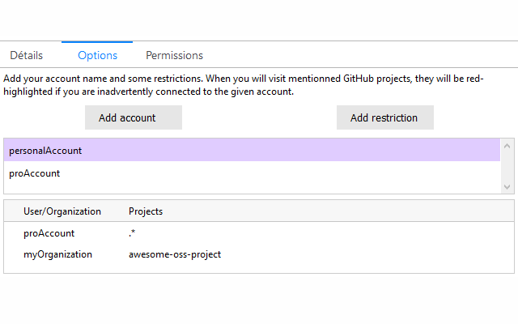
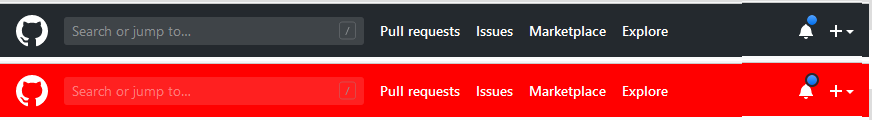

This extension allows to being notified when you are connected to the wrong GitHub account for a project.

## How to use it

For a given account, add restrictions that you want to be notified

Afterwards, if you are connected with your `personalAccount`, if you open one of proAccount projects, or myOrganization/awesome-oss-project, you will be notified:

The top of the GitHub bar will be red-highlighted

